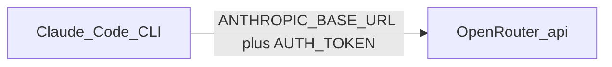

# OpenRouter + Claude Code setup (repeatable guide)

This guide walks through installing **Claude Code**, connecting it to **OpenRouter** (including free models you enable in your account), and verifying everything—so you can repeat the same steps on a new machine or repo without guesswork.

**Official references**

- [Claude Code integration with OpenRouter](https://openrouter.ai/docs/guides/coding-agents/claude-code-integration)
- [OpenRouter API keys](https://openrouter.ai/settings/keys)
- [OpenRouter Activity](https://openrouter.ai/activity) (confirm requests and spend)

---

## What you are setting up


| Piece                          | Role                                                                                                                              |
| ------------------------------ | --------------------------------------------------------------------------------------------------------------------------------- |
| **OpenRouter**                 | Gateway for models; you use one API key and pick models in app settings or code.                                                  |
| **This repo’s Python sample**  | Uses `OPENROUTER_API_KEY` in `.env` (see `.env.example`).                                                                         |
| **Claude Code (`claude` CLI)** | Does **not** read `.env` for API auth. You give it OpenRouter via **environment variables** or `**.claude/settings.local.json`**. |


Both the Python app and Claude Code are separate clients of OpenRouter; they can share the same account and credits.

---

## Prerequisites

1. An [OpenRouter](https://openrouter.ai/) account and an API key from [API keys](https://openrouter.ai/settings/keys).
2. For **free** models: configure [guardrails](https://openrouter.ai/workspaces/default/guardrails) and model access the way OpenRouter documents (same as this repo’s [README](../../README.md)).
3. **Windows** with PowerShell (this guide uses PowerShell examples).

---

## Step 1 — Install Claude Code

**Recommended on Windows (native installer):**

```powershell
irm https://claude.ai/install.ps1 | iex
```

**Alternative (requires Node.js 18+):**

```powershell
npm install -g @anthropic-ai/claude-code
```

**Check the CLI:**

```powershell
claude --version
```

If the command is not found, close and reopen PowerShell (or sign out/in) so `PATH` updates.

---

## Step 2 — Wire OpenRouter into Claude Code

Claude Code expects an Anthropic-compatible endpoint. OpenRouter provides that at `**https://openrouter.ai/api**`. You must set:


| Variable               | Value                                    |
| ---------------------- | ---------------------------------------- |
| `ANTHROPIC_BASE_URL`   | `https://openrouter.ai/api`              |
| `ANTHROPIC_AUTH_TOKEN` | Your OpenRouter API key (`sk-or-v1-...`) |
| `ANTHROPIC_API_KEY`    | **Exactly** empty (`""`)                 |


**Why empty `ANTHROPIC_API_KEY`?** If it is missing or not explicitly empty, Claude Code may fall back to **Claude subscription** or **Anthropic Console** login instead of OpenRouter. See [OpenRouter troubleshooting](https://openrouter.ai/docs/guides/coding-agents/claude-code-integration).

### Option A — Project-only (good for this repository)

1. At the **project root** (next to `main.py`), create `.claude/settings.local.json`:

```json
{
  "env": {
    "ANTHROPIC_BASE_URL": "https://openrouter.ai/api",
    "ANTHROPIC_AUTH_TOKEN": "<your-openrouter-api-key>",
    "ANTHROPIC_API_KEY": ""
  }
}
```

1. **Do not commit secrets.** This repo lists `.claude/settings.local.json` in `.gitignore` (same idea as `.env`).
2. **First launch on Windows:** If the login wizard still appears (see [Troubleshooting](#troubleshooting-select-login-method)), use [Option B](#option-b--reliable-first-launch-powershell) once, then you can rely on Option A.

### Option B — Reliable first launch (PowerShell)

In **one** PowerShell window, set variables **before** running `claude` (replace the token):

```powershell
cd <your-project-root>
$env:ANTHROPIC_BASE_URL = "https://openrouter.ai/api"
$env:ANTHROPIC_AUTH_TOKEN = "<your-openrouter-api-key>"
$env:ANTHROPIC_API_KEY = ""
claude
```

Include the line `$env:ANTHROPIC_API_KEY = ""`. Skipping it can leave the variable unset and trigger the wrong login path.

### Option C — All sessions (user-wide)

Add the same three variables to your **user** environment variables or your **PowerShell profile** (`$PROFILE`), for example:

```powershell
$env:OPENROUTER_API_KEY = "<your-openrouter-api-key>"
$env:ANTHROPIC_BASE_URL = "https://openrouter.ai/api"
$env:ANTHROPIC_AUTH_TOKEN = $env:OPENROUTER_API_KEY
$env:ANTHROPIC_API_KEY = ""
```

---

## Step 3 — Clear old Anthropic login (if you used it before)

If you previously signed into Claude Code with a **Claude subscription** or **Anthropic Console**:

1. `cd` to the project root and run `claude`.
2. **Inside the Claude Code UI** (not in PowerShell), run `/logout`.

Slash commands like `/logout` and `/status` are typed **in Claude Code’s prompt**, not in PowerShell.

---

## Step 4 — Run and verify

1. **PowerShell:** `cd` to the project root and start Claude Code:
  ```powershell
   cd <your-project-root>
   claude
  ```
2. Wait until the **Claude Code** session UI is open.
3. **Inside Claude Code**, type `/status` and press Enter.
4. Confirm the output shows `**ANTHROPIC_AUTH_TOKEN`** (or equivalent) and **Anthropic base URL:** `https://openrouter.ai/api`.
5. Optional: use [OpenRouter Activity](https://openrouter.ai/activity) to see requests after you send a message or use a tool.

**Remember:** `/status` is **not** a PowerShell command. Typing it in plain PowerShell before `claude` does nothing useful.

---

## Troubleshooting: `Select login method`

You might see:

- **(1) Claude account with subscription**
- **(2) Anthropic Console account**
- **(3) Third-party platform** (e.g. Bedrock, Foundry, Vertex)

That screen means Claude Code has **not** picked up the OpenRouter env **before** the UI starts.

**Do not choose 1–3** unless you actually want those products.

**Fix:**

1. Press **Ctrl+C** to exit.
2. `cd` to the project root (folder that contains `.claude\`).
3. Run `Test-Path .\.claude\settings.local.json` — should be `True` if you use Option A.
4. Use [Option B](#option-b--reliable-first-launch-powershell) (set `$env:…` then `claude`).
5. If you see a **one-time** prompt to approve **API / custom endpoint** usage, approve it so the OpenRouter token is used—then run `/status` again.

If the wizard keeps returning, add the three variables to your user environment or profile ([Option C](#option-c--all-sessions-user-wide)).

---

## Optional: Quick functional test (Claude Code + your repo)

After `/status` looks correct:

1. From the project root, run `claude`.
2. Ask Claude Code to do a small, safe refactor (example: move the OpenRouter model id from `main.py` into a root `config.yaml` and load it in code; update `pyproject.toml` if you add a YAML library).
3. Run your app (e.g. `.\.venv\Scripts\python.exe main.py` if you use a venv).
4. Review `git diff` and confirm secrets stay in `.env`, not in `config.yaml`.

---

## Optional: Model and routing hints (OpenRouter)

- [Provider routing](https://openrouter.ai/docs/features/provider-routing) — OpenRouter suggests prioritizing **Anthropic 1P** for best Claude Code compatibility.
- In `env` or your profile you can set variables such as `ANTHROPIC_DEFAULT_SONNET_MODEL` to OpenRouter model ids (for example `anthropic/claude-sonnet-4.6`). Details: [Claude Code integration](https://openrouter.ai/docs/guides/coding-agents/claude-code-integration).

---

## One-page checklist (copy for next time)

- `claude --version` works.
- `.claude/settings.local.json` **or** shell has `ANTHROPIC_BASE_URL`, `ANTHROPIC_AUTH_TOKEN`, `ANTHROPIC_API_KEY=""`.
- If login wizard appears: Ctrl+C, then set `$env:…` in PowerShell and run `claude` again.
- `/logout` in Claude Code if you used Anthropic login before.
- `claude` from project root → `/status` → base URL `https://openrouter.ai/api`.
- Optional: confirm on [OpenRouter Activity](https://openrouter.ai/activity).

---

## Mental model




Your Python scripts use `**OPENROUTER_API_KEY**` in `.env`; Claude Code uses the `**ANTHROPIC_***` variables above. Same OpenRouter account; different configuration.


NOTE:  
To use openrouter API key with Free LLMs, you need to enable the privacy & guardrails from your openrouter account > leftmenu > Privacy & Gurardrails > create new > add API Key > save.